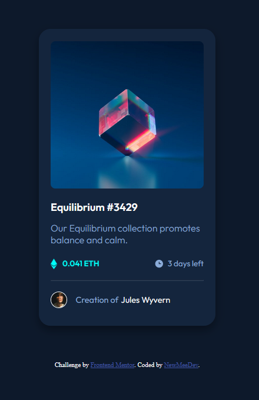

# Frontend Mentor - NFT preview card component solution

This is a solution to the [NFT preview card component challenge on Frontend Mentor](https://www.frontendmentor.io/challenges/nft-preview-card-component-SbdUL_w0U). Frontend Mentor challenges help you improve your coding skills by building realistic projects. 


### Screenshot




### Built with

- Flexbox
- Background-Image-Overlay
- Pseudo-Elements

### What I learned

- Using CSS Flexbox
- How to create a color overlay with background images
- How to add small icons to text using the CSS pseudo element ::before
<<<<<<< HEAD
- Using CSS transitions
=======
>>>>>>> 8a41c37c02d4c3c066dc74fc686e578bb2114509

### Code snippets

```html
<div class="logo">
  <div class="overlay-effect">
    
  </div>
</div>
```

```css
.logo {
    margin: 20px;
    background: url(images/image-equilibrium.jpg) 0 0 no-repeat; 
    height: 250px;
    background-size: cover;
    border-radius: .5em;;
<<<<<<< HEAD
}

.overlay-effect {
    min-height: 250px;
    opacity: 0;
    transition: 1s ease;
    background-color: rgba(0, 255, 247, 0.7);
    border-radius: .5em;
    display: flex;
    justify-content: center;
    align-items: center;
}

.logo:hover .overlay-effect {
    opacity: 1;
    cursor: pointer;
}
```
=======
}

.overlay-effect {
    min-height: 250px;
    opacity: 0;
    transition: 1s ease;
    background-color: rgba(0, 255, 247, 0.7);
    border-radius: .5em;
    display: flex;
    justify-content: center;
    align-items: center;
}

.logo:hover .overlay-effect {
    opacity: 1;
    cursor: pointer;
}
```
>>>>>>> 8a41c37c02d4c3c066dc74fc686e578bb2114509
